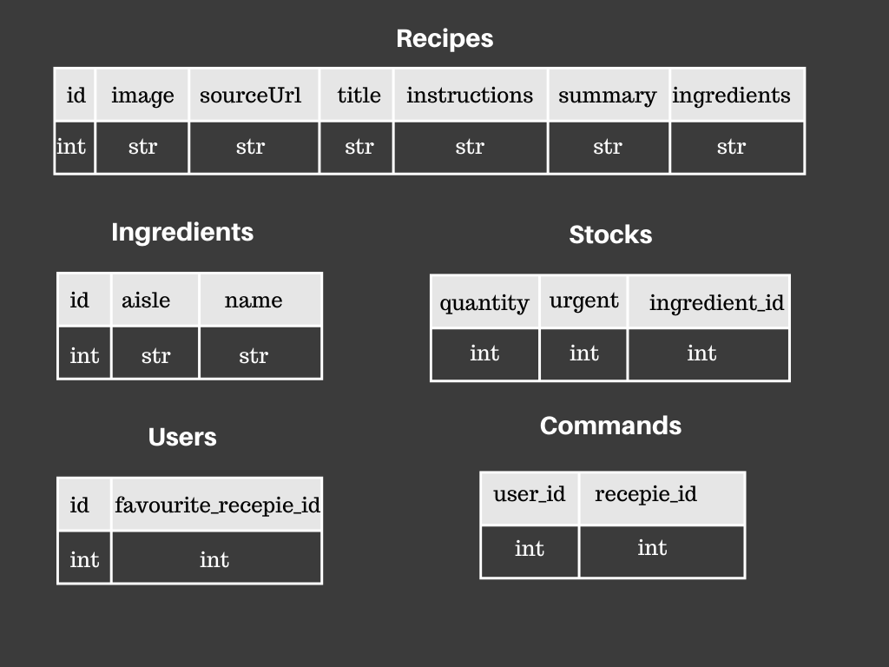

# Creation of the database

This folder is dedicated to creating the database used by the app. This database is composed of 5 tables (that you can see below). 

  

No connections are done between those tables for practical reasons that are explained in the notebooks. The database was build in 5 steps:

### Collect the data
The data for the recipes was collected by the API of [spoonacular](https://spoonacular.com/food-api/docs). You can find the codes used to collect this data in the file
[get_from_api](./get_from_api.ipynb)

### Clean the collected data
The second step was to clean this data. This enabled us to build the database with our 2 first tables: Recipes and Ingredients. Ingredients are all the ingredients 
needed for the recipes and only those. [clean_raw_data](./clean_raw_data.ipynb)

### Create table Users
The table users was simply created adding one random recipe_id to the id user that was generated from 1 to 10000. [create_users](./create_users.ipynb)

### Create table Stocks
The stock table was also generated randomly. However I made sure that there is less product close to the expiration date than product far from it. 
[creatstock](./create_stock.ipynb)

### Create table Commands
To create the commands history I used the favourite recipe of each client, a random factor, and tf-idf on the recipe's summary and instructions. In other word each client was 'exposed' to each recipes, the
more this recipe was similar to his favourite one the more the command had a chance to be added. [create_commands](create_commands.ipynb)

In the end I had about 1000 recipes, 1235 ingredients, 10000 users and 600000 commands. These numbers can change due to random factors

