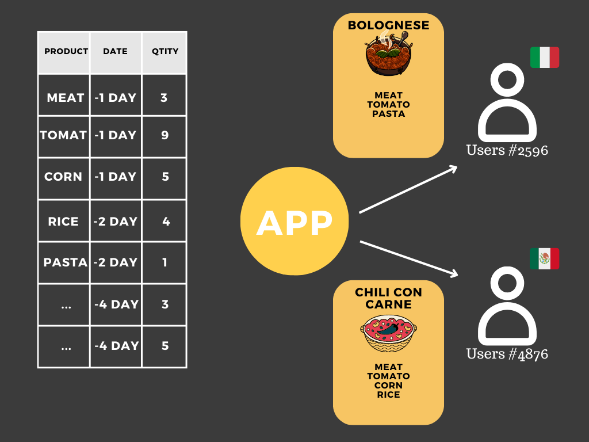
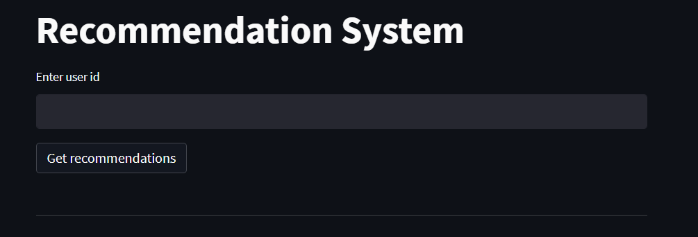
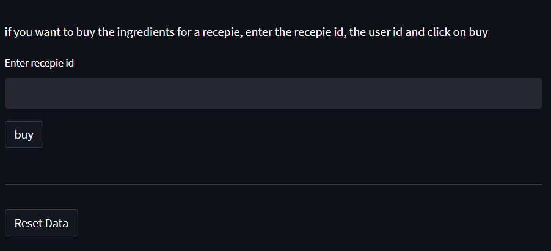

# Anti Food waste app
[__Jumpertz Sacha__](https://www.linkedin.com/in/jumpertz-sacha)

Food waste is a critical global problem, with staggering statistics revealing that approximately __one-third__ (_40%_ in America) of all food produced for human consumption is wasted every year. This alarming figure not only contributes to the exacerbation of famines and hunger worldwide but also has a severe ecological impact.

The ecological impact of food waste cannot be underestimated. When food is discarded and sent to landfills, it decomposes and releases GHG, particularly methane, which is a potent contributor to climate change (Up to _10%_ of global greenhouse gases comes from food that is produced, but not eaten. Source: _United Nations Environment Program (UNEP) (2021). Food Waste Index Report 2021_). 

Additionally, the production, transportation, and disposal of wasted food require vast amounts of energy, water, and other valuable resources. I could give a bunch of impressive numbers to demonstrate how food waste is harmfull, but the conclusion will still remain the same, fighting food waste should be a priority.

## The app
The goal of this repo is to build an 'app' that will reduce the food waste coming from supermarket. Supermarket are not the biggest contributors to food waste, but still, when their products come to their expiration date they have no other choice than throwing the away. 

The app will be connected to the supermarket's database. It will thus have access to the products that are close to expriration date but also to the taste of the users. The mission of tha app will be to suggest to each users a recipe that maximize the number of 'saved' products and the 'happiness' of the user.

  

## Execution steps

* Create the databases 
* Create a recommendation system 
* Build the app 

### Create the databases
In this part I created the database I will use to do my app. The recipes come from an API, and data like users profile, command history,... had to be created from scratch. I tried to create the most coherent database even though some 'concessions' had to be done. You can find a more precise description of the database and all the codes used to create it into the folder [Build_db](./Build_db).

### Recommendation system
In the file [recommendation_system](recommendation_system.ipynb) you will be able to find a notebook that explains how the recommendation system is working. In summary it will maximize the number of saved prodcts and the 'happiness' of the user. This file won't be used afterward as such (as it is a notebook). Still you will find there the codes that will be used in the app.

### Build the app
The last step consisted into building the app. In order to do that, I had to write the recommendation system into a python file and to build a user interface with streamlit. I also added a file to update with functions to reset the database or to add data to tables. You can find those files into the folder [App](./App).

## Usage
### set up the database
To be able to use the app, you have at first to set up the database. To do that you have to run the notebook in the folder Build_db. The order in which you have to run them is explicited into the readme of the folder.

### use the app
Then you are able to use the app. You can see below the interface of the app. To have the suggestions you have to enter the id of the user (1-10000) and then click on _Get recommendation_.

  

After a few moment, you will be able to scroll through 3 suggestions of recipes, seeing a picture, their descriptions, a link to the recipe,...

  

At the bottom of the page you will have 2 others actions. You can 'buy' a recipe, this will automatically add the command into the Commands table. You can also push on Reset Data, this will reset the tables Customers, Commands ans stocks.

  

## Limits
To have a more complete project, the ideal would be to have better data. This app do not take into account quantities of the recepies neither the different kind of food. Also the quality of the app could be easily increased with some UX and more interaction with the databases.

